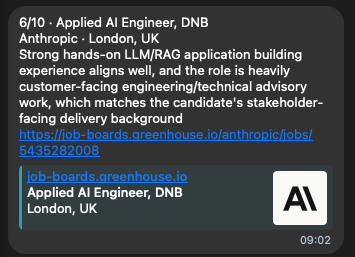
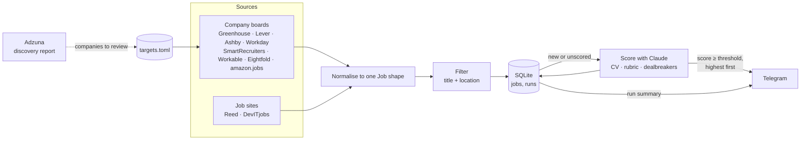

# job-radar

Every morning, job-radar checks about 60 companies' job boards and two UK job sites for AI engineering roles, filters them by title and location, has Claude score each new match against a CV, and sends the best ones to a Telegram chat, highest score first. One summary message ends every run, so a quiet day and a broken run look different.

## Why it exists

Checking dozens of careers pages by hand every day is slow and easy to get wrong, and most postings are a poor fit. job-radar does the checking and the first read, so only strong matches need human attention. It is also a deliberately small, fully visible example of an LLM system: plain Python (`requests` and the standard library), no frameworks, with sources, storage, scoring, evaluation and notification each in a short module that can be read end to end.

## What it does

- **Fetches** open jobs from each target company's board: Greenhouse, Lever, Ashby, Workday, SmartRecruiters, Workable, Eightfold and amazon.jobs.
- **Searches** Reed.co.uk (direct employers only) and reads DevITjobs.uk, skipping employers already fetched from their own board so a job isn't found twice.
- **Filters** by title keywords and location, as whole words ("rag" doesn't match "coverage").
- **Stores** matches in SQLite, deduplicated by `source:company:job_id`, so running twice never stores or sends a job twice.
- **Scores** each new match from 1 to 10 against the CV, a rubric, candidate facts and dealbreakers. A dealbreaker counts only when the model quotes the posting stating it; the code checks the quote and caps the score at 3.
- **Notifies** Telegram of jobs at or above the threshold, highest score first, then sends a run summary (fetched, matched, new, sent, cost, errors).
- **Keeps going** when a board, an API call or a message fails: the error is logged, recorded in the `runs` table and quoted in the summary.
- **Discovers** new companies on demand (`python -m jobs.discover`): searches Adzuna for employers hiring for matching titles, guesses their board, and prints entries to review. It never edits the target list.

A Telegram alert:



## Architecture



More detail: [`docs/design.md`](docs/design.md) (data flow, job shape, decisions on sources) and [`docs/scoring.md`](docs/scoring.md) (prompt, checks, retries and cost, step by step).

## Setup

Python 3.11 or later.

```bash
python -m venv .venv && source .venv/bin/activate
pip install -r requirements.txt

cp .env.example .env                                # ANTHROPIC_API_KEY, TELEGRAM_BOT_TOKEN, TELEGRAM_CHAT_ID; optional REED_API_KEY, Adzuna pair
cp config/targets.example.toml config/targets.toml  # companies and their job boards
cp config/profile.example.toml config/profile.toml  # filter, rubric, dealbreakers, threshold, search sources
```

Put the CV as plain text or Markdown in `config/cv.md`. Environment variables are read from the shell: `set -a; source .env; set +a`.

## Run

```bash
python -m jobs.radar --dry-run   # preview matches: no database, no LLM, no Telegram
python -m jobs.radar             # fetch, filter, store, score, notify
python -m jobs.discover          # companies hiring for matching titles that aren't targets yet (needs Adzuna keys)
```

### On a schedule (macOS launchd)

`scripts/run_radar.sh` loads `.env` and runs the radar once; `scripts/com.getjo.radar.plist` runs it daily at 09:00 and appends output to `data/radar.log`.

```bash
# install (from the repo root; .env and .venv must exist)
sed "s|REPO_DIR|$PWD|g" scripts/com.getjo.radar.plist > ~/Library/LaunchAgents/com.getjo.radar.plist
launchctl bootstrap gui/$(id -u) ~/Library/LaunchAgents/com.getjo.radar.plist

# check, run once now, follow the log, see recorded runs
launchctl print gui/$(id -u)/com.getjo.radar | grep -E "state|runs|last exit"
launchctl kickstart gui/$(id -u)/com.getjo.radar
tail -f data/radar.log
sqlite3 data/jobs.db "SELECT * FROM runs ORDER BY id DESC LIMIT 3"

# uninstall
launchctl bootout gui/$(id -u)/com.getjo.radar && rm ~/Library/LaunchAgents/com.getjo.radar.plist
```

A run missed while the Mac is asleep starts on wake; a run missed while it is shut down is skipped.

## Tests and evaluation

```bash
python -m unittest                              # ~240 unit tests; no network, HTTP mocked with fixtures in tests/fixtures/
python -m evals.run                             # score hand-labelled real jobs, compare with the labels
python -m evals.run --ci --min-agreement 8      # the committed made-up set; exits 1 below 8 of 10 agreements
```

The evaluation reports agreement, precision and recall for "apply", a threshold sweep, every disagreement, and any reason that speculates about the candidate's personal circumstances. Prompt, model and threshold changes were each measured this way before being kept (see `docs/scoring.md`).

GitHub Actions runs the unit tests on every push. When scoring code or the eval changes, it also runs the scoring eval on `evals/ci/` (a fictional candidate and ten fictional postings) with the real model and fails the build below 8 of 10 agreements. It needs the repository secret `ANTHROPIC_API_KEY`; a run costs about $0.05.

## Known limitations

- **Coverage.** Companies on other systems (Avature, custom careers sites such as Google's or Meta's) can't be fetched; their roles arrive only if they appear on Reed or DevITjobs.
- **Undocumented feeds.** Workday, Eightfold, amazon.jobs and DevITjobs' job list are the endpoints their own pages call, not public APIs. A change on their side shows up as a fetch error for that source; the rest of the run continues.
- **Duplicates across sources** are detected by employer name only, so the same job posted by a recruitment agency, or under a different company name, can arrive twice.
- **Descriptions vary.** Lever and Ashby give a shorter summary than the full posting; a dealbreaker stated only in an omitted section can't be quoted, so the job isn't capped.
- **Thresholds are model-specific.** Changing the scoring model means re-reading the eval's threshold sweep, not keeping the old number.
- **Runs on one Mac.** If it is off, nothing runs and nothing outside the Mac raises an alert; the missing daily summary is the only signal.
- **Cost** is about $0.012 per newly scored job with Claude Sonnet 5; a typical day costs a few cents, a day with many new postings around $1.

## What's next

- Paste-in command for a single job found by hand (any site), stored, scored and notified like the rest.
- Run in Azure (Container Apps job on a schedule, Key Vault, managed identity) with an external "dead man's switch" that alerts when a daily run doesn't check in.
- Job-alert emails as a discovery feed.
- Application pack: tailored CV bullets for one job, checked against the CV for invented claims.

Progress and decisions by iteration: [`docs/ROADMAP.md`](docs/ROADMAP.md).
