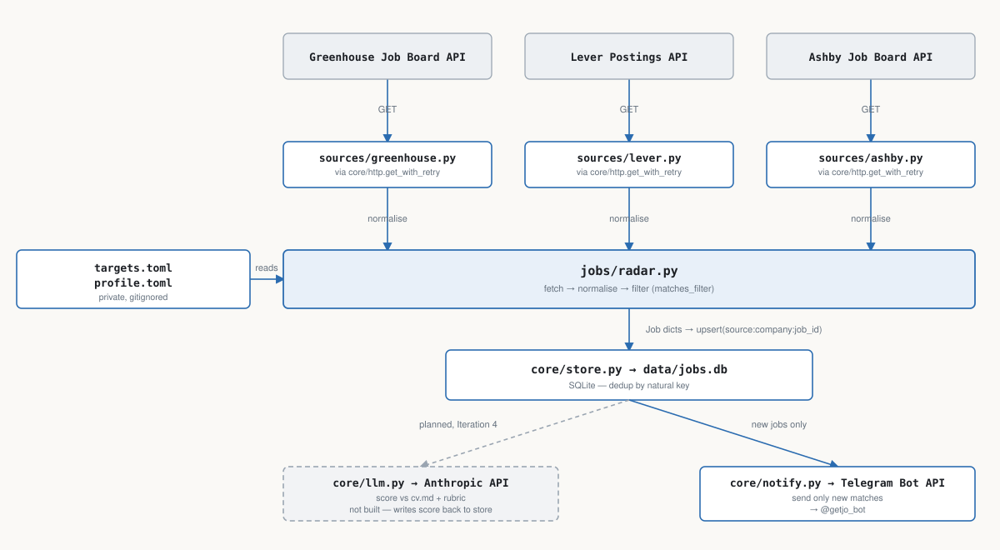

# job-radar

Watches public job boards (Greenhouse, Lever, Ashby) for AI engineering roles, filters them, scores each one against a candidate's CV with Claude, and sends strong matches to a Telegram chat.

Built with plain Python (`requests` + standard library) and no frameworks, as a small, fully visible example of an LLM system: sources, storage, scoring, evaluation and notification.

Status: in development. See `docs/ROADMAP.md` for progress, `docs/design.md` for the architecture, and `docs/scoring.md` for how a job gets its score.

## What it does

- Fetches open jobs from each configured company's Greenhouse, Lever or Ashby board.
- Filters by title keywords and location: on-site roles in the listed locations, and remote roles only in the listed regions (`config/profile.toml`).
- Stores matches in SQLite, deduplicated by `source:company:job_id`.
- Scores each new match from 1 to 10 against the CV, a rubric of preferences and a list of dealbreakers. A dealbreaker only counts when the model quotes the posting stating it, and the code then caps the score at 3.
- Sends jobs scoring 7 or more to Telegram, with the score, the top reason and the link. A job is never sent twice.
- Keeps going when one board, one API call or one message fails: the error is logged and recorded in the `runs` table, and the run continues.
- Measures scoring against hand-labelled jobs with `python -m evals.run`: agreement, precision and recall for "apply", and every disagreement.

## Architecture



## Setup

```bash
python -m venv .venv && source .venv/bin/activate
pip install -r requirements.txt

cp .env.example .env                                # ANTHROPIC_API_KEY, TELEGRAM_BOT_TOKEN, TELEGRAM_CHAT_ID
cp config/targets.example.toml config/targets.toml  # companies and their job boards
cp config/profile.example.toml config/profile.toml  # filter, rubric, dealbreakers, threshold
```

Add the CV as plain text or Markdown in `config/cv.md`. Environment variables are read from the shell: `set -a; source .env; set +a`.

For the evaluation, label some stored jobs as `apply`, `maybe` or `skip` in `evals/cases/scoring.jsonl`; `evals/cases/scoring.example.jsonl` shows the format.

## Run

```bash
python -m jobs.radar --dry-run   # preview matches; no database, LLM or Telegram
python -m jobs.radar             # fetch, filter, store, score, and notify
python -m evals.run              # score the labelled jobs and compare with the labels (~$0.08)
python -m unittest               # test suite; no network, fixtures in tests/fixtures/
```

## Known limitations

- Only Greenhouse, Lever and Ashby boards are supported. Companies on Workday, Workable, SmartRecruiters or a custom applicant-tracking system are skipped.
- No scheduler yet: jobs are checked only when `python -m jobs.radar` runs. A twice-daily schedule and a daily summary are planned.
- Scores cluster around 8 for any reasonable fit, so strong and borderline matches are hard to separate with the threshold alone.
- Description quality varies by source: Greenhouse provides the full posting; Lever and Ashby provide a shorter summary without their bullet-list sections.
