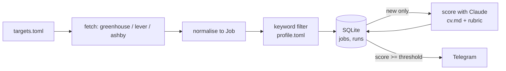

# Design

## Purpose

Find relevant job openings from company job boards without checking them by hand, and send only the ones worth reading to Telegram.

## Data flow

## Job shape (shared by all sources)

| field | type | note |
|---|---|---|
| id | str | `source:company:job_id`, primary key |
| source | str | greenhouse, lever, ashby |
| company | str | from targets.toml |
| title | str | |
| location | str | as given by the board |
| url | str | public posting URL |
| description | str | plain text, HTML stripped |
| first_seen | str | ISO timestamp, set on insert |
| score | int or null | null until scored |

## Decisions

One line each: date, decision, reason.

- 2026-09-28: No frameworks; plain `requests` + stdlib, so every part of the system is visible and explainable.
- 2026-09-28: SQLite over files; gives deduplication by primary key and a `runs` history for free.
- 2026-09-28: Filter by keywords before calling the LLM, so cost scales with relevant jobs, not all jobs.
- 2026-09-29: `targets.toml` and `profile.toml` are gitignored with committed `.example.toml` copies; the job search stays private once the repo is public.
- 2026-09-29: Env vars are loaded by the shell (`set -a; source .env; set +a`), not parsed in code; the same path works under cron, launchd and GitHub Actions.
- 2026-09-30: Greenhouse's `content` field is HTML-entity-escaped on top of the HTML itself (e.g. `&lt;div&gt;`); `sources/greenhouse.py` unescapes once, then strips tags with stdlib `HTMLParser`, no HTML library dependency needed.
- 2026-09-30: `--dry-run` skips `core.store` and `core.notify` entirely rather than storing-but-not-notifying; a dry run has zero side effects, so it can be re-run any number of times without ever affecting what the next real run considers "new".
- 2026-09-30: `jobs/radar.py` catches a per-company fetch failure, logs it, and continues rather than letting one bad board stop the whole run; the error text is written to `runs.errors`. Lever/Ashby resilience and richer failure tests land in Iteration 3 — for now this is the minimum needed so one company can't take down the run.
- 2026-09-30: `sources/lever.py` uses Lever's `descriptionPlain` field directly instead of stripping HTML like Greenhouse — Lever already provides a plain-text variant, so no parsing needed. Its description is shorter than Greenhouse's (missing the bullet-list sections), acceptable for now since scoring quality isn't evaluated until Iteration 5; revisit if evals show it hurts match quality.
- 2026-09-30: `jobs/radar.py` now dispatches fetchers via a `FETCHERS = {"greenhouse": ..., "lever": ...}` dict instead of an if/elif chain — this is the second real source, which is the point "no abstraction until two real uses" says to introduce one.
- 2026-09-30: `sources/ashby.py` mirrors `lever.py` — same retry loop, and Ashby also gives `descriptionPlain` directly. All three sources now have near-identical `_get_with_retry` functions; extracting the shared HTTP helper is the next task specifically so the duplication is visible in three real call sites before abstracting it, not guessed at from one or two.
- 2026-09-30: `core/http.get_with_retry(url, *, label)` replaces each source's private retry loop; `label` is just for log lines, so one source retrying doesn't get confused with another. `notify.py`'s retry loop stays separate — it's a POST with a JSON body, a different shape than the three GET call sites this actually unifies.
- 2026-09-30: Verified live — a deliberately wrong Greenhouse board name gets logged (`fetch failed for BrokenCo: 404 ...`) and skipped; the run still completes and the error lands in `runs.errors`. One source failing doesn't stop the others.
- 2026-09-30: Architecture diagram exists twice, deliberately: `docs/architecture.svg` is a static, self-contained file (no CSS variables, no external fonts) so it renders on GitHub and doesn't depend on a live link; the Claude Artifact version linked from the README is the themed/dark-mode-aware one, for browsing rather than for the repo's permanent record. The Mermaid block already in this file stays as the terse, always-renders-in-any-markdown-viewer version.
- 2026-09-30: `config/profile.toml`'s `scoring.model` was `claude-haiku-4-5-20251001` (a stale, dated ID) — corrected to `claude-haiku-4-5`. Current Anthropic model IDs don't carry date suffixes; verified against the live API before changing it, not just from memory.
- 2026-09-30: `core/llm.complete()` returns a `Completion` dataclass (`text`, `input_tokens`, `output_tokens`, `cost`), not just a string — `jobs/radar.py` needs to sum `cost` across every scoring call in a run to print a total, which the roadmap's acceptance criterion for this iteration requires.
- 2026-09-30: `core/llm.py` has its own private POST-with-retry, not a shared one with `notify.py` — same reasoning as the GET helper: wait for the duplication to be real (a third POST caller) before extracting it, rather than guessing at the shared shape from two.
- 2026-09-30: Per-model $/token pricing lives in a small `PRICING` dict in `core/llm.py`, keyed by exact model ID. An unpriced model (e.g. after a model swap without updating this table) makes `cost` `None` rather than silently wrong — a missing entry is loud, not a guess.
- 2026-09-30: Scoring prompt puts the trusted CV and rubric in `system` and the untrusted job posting in `user`, inside `<job>` tags, with an instruction to treat it as data, not instructions (prompt-injection hygiene). The JSON asks for `reasons` before `score` so the model states evidence before picking a number. Reasons and red flags aren't stored; only `score` goes in the database.
- 2026-09-30: First real scoring call (Haiku 4.5): ~2,600 input / ~250 output tokens, $0.0038 per job. The reply came wrapped in markdown fences despite the prompt saying not to, so the parser must tolerate them.
- 2026-10-01: `parse_score()` strips markdown fences before `json.loads`, rather than counting a fenced reply as invalid and paying for a retry that would likely come back fenced too. The shape check is strict: `score` a whole number 1–10 (`True` and `7.5` rejected), `reasons` a non-empty list of strings (Telegram needs a top reason), `red_flags` a list of strings. Any failure means retry once with the same prompt, then `None` (unscored).
- 2026-10-01: `score_with_retry()` returns every completion it made, so the per-run cost total includes retries. API errors (after `core/llm.py`'s own retries) propagate; `radar.py` catches them per job.
- 2026-10-01: Scores aren't fully repeatable: the same job scored 2, then 3, at the API's default temperature. Consider `temperature: 0` before Iteration 5's evals, so a changed score means the prompt changed, not the dice.
- 2026-10-01: `radar.py` scores every matching job whose score is still `NULL` — new jobs plus earlier failures — instead of only new ones, so an unscored job gets another try next run instead of being skipped forever. Notifying is idempotent because it happens only when a score goes from `NULL` to a number, and a job with a score is never scored again.
- 2026-10-01: The score is written after the Telegram send succeeds, not before. If the send fails, the job stays `NULL` and is rescored and resent next run (about $0.004 extra) rather than stored as scored but never delivered. Scoring and sending errors are caught per job and recorded in `runs.errors`.
- 2026-10-01: Logging now goes to stdout (`stream=sys.stdout`), as CLAUDE.md asks; `basicConfig` defaults to stderr.
- 2026-10-01: Retrying unscored jobs is capped at 3 runs (`MAX_SCORE_ATTEMPTS` in `radar.py`), tracked in a new `jobs.score_attempts` column. Every run that tries a job counts, whatever the outcome — including a failed Telegram send, because a message Telegram permanently rejects would otherwise trigger a paid rescoring on every run forever. After the 3rd failure the job is logged ("giving up…") and left `NULL`. Worst case per job: 3 runs × 2 calls ≈ $0.024.
- 2026-10-01: Location filter: London on-site/hybrid always passes; a remote role passes only if its location also names a US state, "us"/"united states", a European country, "europe", "emea" or "eu" (`remote_places` in `profile.toml`). Location terms match whole words, so "us" doesn't match "Australia" and "london" doesn't match "Londonderry". US boards name the state ("Remote - Texas"), hence the state list. Two-letter state codes are left out because "in" and "ca" are ordinary words or other countries. "London is primary" is a preference, so it lives in the scoring rubric, not the yes/no filter.
- 2026-10-01: Iteration 4 acceptance, live on OpenAI + Isomorphic Labs: 9 jobs scored on the first try (no retries), 7 sent, $0.039 total (~$0.0043 per job); an immediate second run scored and sent nothing, $0.0000. Research and people-management roles scored 2; hands-on Applied AI Engineer roles 8. 7 of 9 reached the threshold, and a role requiring Spanish scored 7: the threshold and rubric need checking against hand labels in Iteration 5.
- 2026-10-01: Eval set: 20 stored jobs picked by a seeded round-robin over (company, London/remote) groups, not by guessed fit, so the set covers likely applies, maybes and skips. Labels are written blind: `scoring.jsonl` holds no Claude scores, so the labels measure the model instead of echoing it. The file is gitignored like `targets.toml` (real job IDs plus personal verdicts); `scoring.example.jsonl` shows the format. Iteration 6 will need another source of cases for CI, which has neither this file nor the database.
- 2026-10-02: Scoring runs at `temperature: 0` (radar and evals alike), so a changed eval number reflects a changed prompt more than chance. It still isn't fully deterministic: two baseline runs differed on 2 of 20 verdicts, so a difference of 1–2 cases is noise. Compare prompts on two runs each, not one.
- 2026-10-02: **Eval baseline** (prompt as of `81035fa`, rubric unchanged, threshold 7, 20 cases: 4 apply / 5 maybe / 11 skip). Run 1: agreement 12/20 (60%), apply precision 4/7 (57%), apply recall 4/4 (100%). Run 2: 13/20 (65%), 4/8 (50%), 4/4. $0.08 per run. Every disagreement has Claude higher than the label; in most, Claude names the dealbreaker (Spanish required, pre-sales, 20% travel) as a red flag yet still scores 4–7. Detection works; the prompt doesn't say these disqualify.
- 2026-10-02: **Change 1: dealbreakers** (`dealbreakers` in `profile.toml`: non-English language, travel 25%+, active sales, junior, people-manager; prompt says score ≤3 and name it first). "Not AI" and "research" stay rubric preferences. Two runs: agreement 11/20, 12/20; apply precision 3/5, 4/6 (60–67%, up from 50–57%); apply recall 3/4, 4/4. Result: no skip-labelled job is sent any more (the baseline sent the Spanish-speaking role and once the Quants role), but a job labelled apply was dropped in 2 of 4 runs because Claude inferred unstated travel. Claude also names a dealbreaker without applying it (SSA: "travel up to 30%", scored 4, every run). Next change: Claude returns each dealbreaker with a quote from the posting; code caps the score at 3.
- 2026-10-02: **Change 2: quote-backed dealbreakers, cap applied in code.** The prompt numbers the dealbreakers and asks for `{"number", "quote"}` for each one the posting states; it no longer asks Claude to lower the score. `apply_dealbreakers()` keeps a claim only if its quote really appears in the posting (case, spacing and curly quotes/dashes normalised) and its number exists, then caps the score at 3. Two identical runs: agreement 15/20, apply precision 4/8 (50%), apply recall 4/4. The apply-labelled job lost to inferred travel is back in both runs; the "named it, scored 4" case is now capped; all five dealbreaker-type skips now agree. Remaining extras sent: three maybe-labelled roles and one skip (OpenAI Quants, now 8): scores for non-dealbreaker roles rose slightly once the prompt said dealbreakers are handled separately. Precision is now mainly a threshold question. Trade-off accepted: a paraphrased quote drops a real dealbreaker, which risks an extra send rather than a missed apply.
- 2026-10-02: `notify_threshold` stays at 7. The eval's threshold sweep (one run, same scores) shows apply-labelled jobs scored 7, 8, 8, 8 and the extra sends score 7–8 too, nothing reached 9: at 8, precision stays 50% and one apply is lost; at 9 nothing is sent. The score doesn't separate applies from maybes at the top, so better precision has to come from the scoring, not the cutoff. The eval prints this sweep on every run, so future prompt changes show their effect at every threshold for the price of one run.
- 2026-10-02: `parse_score()` accepts an empty `reasons` list. With dealbreakers, Claude often puts everything in `red_flags`; rejecting that turned correct skips into "unscored" and wasted a retry each. The Telegram message falls back to the first red flag.
- 2026-10-01: Schema changes are applied in `store.connect()`: it checks `PRAGMA table_info` and runs `ALTER TABLE … ADD COLUMN` for anything missing, because `CREATE TABLE IF NOT EXISTS` skips an existing table. No migration framework until there's more than one change to manage.

## Known limitations

- Only companies using Greenhouse, Lever or Ashby are covered.
