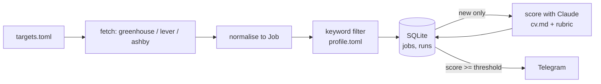

# Design

## Purpose

Find relevant job openings from company job boards without checking them by hand, and send only the ones worth reading to Telegram.

## Data flow

## Job shape (shared by all sources)

| field | type | note |
|---|---|---|
| id | str | `source:company:job_id`, primary key |
| source | str | greenhouse, lever, ashby |
| company | str | from targets.toml |
| title | str | |
| location | str | as given by the board |
| url | str | public posting URL |
| description | str | plain text, HTML stripped |
| first_seen | str | ISO timestamp, set on insert |
| score | int or null | null until scored |

## Decisions

One line each: date, decision, reason.

- 2026-09-28: No frameworks; plain `requests` + stdlib, so every part of the system is visible and explainable.
- 2026-09-28: SQLite over files; gives deduplication by primary key and a `runs` history for free.
- 2026-09-28: Filter by keywords before calling the LLM, so cost scales with relevant jobs, not all jobs.
- 2026-09-29: `targets.toml` and `profile.toml` are gitignored with committed `.example.toml` copies; the job search stays private once the repo is public.

## Known limitations

- Only companies using Greenhouse, Lever or Ashby are covered.
