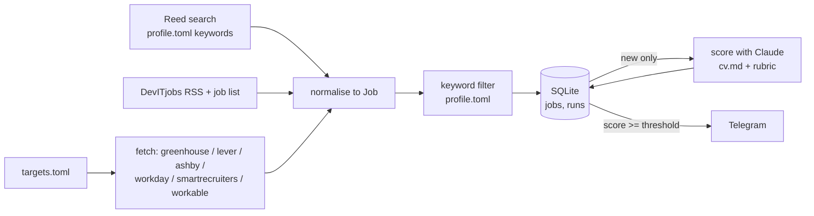

# Design

## Purpose

Find relevant job openings from company job boards without checking them by hand, and send only the ones worth reading to Telegram.

## Data flow

How a job gets its score, step by step (prompt, reply checks, dealbreaker quotes and cap, retries, cost, when it's sent): [`scoring.md`](scoring.md).

## Job shape (shared by all sources)

| field | type | note |
|---|---|---|
| id | str | `source:company:job_id`, primary key |
| source | str | greenhouse, lever, ashby, workday, smartrecruiters, workable, reed, devitjobs |
| company | str | from targets.toml |
| title | str | |
| location | str | as given by the board |
| url | str | public posting URL |
| description | str | plain text, HTML stripped |
| first_seen | str | ISO timestamp, set on insert |
| score | int or null | null until scored |

## Discovery

`python -m jobs.discover`, run by hand, widens the list the daily run watches: it searches Adzuna (title match, near the configured location, last 30 days), drops companies that are already targets, and guesses each remaining company's board name on Greenhouse, Ashby, Lever and SmartRecruiters. A board counts as found only if it lists jobs, and the report shows a sample title to check it is the right company. Workday and Workable aren't probed (Workday names can't be guessed; Workable rate-limits guesses). Nothing is added to `targets.toml` automatically.

## Known limitations

- Only companies using Greenhouse, Lever, Ashby, Workday, SmartRecruiters or Workable are covered.
- Workday lists at most 2,000 postings per site; a target can set `search` (the site's own search text, e.g. "London") to stay under it, and the run log warns when a target hits the cap.
- Workday has no documented public API; the adapter uses the JSON endpoints Workday's own careers pages call, which can change without notice.
- Workday, SmartRecruiters and Reed list postings without (full) descriptions; details are fetched (one request per posting) only for titles that pass the title filter.
- Adzuna takes its app ID and key in the URL, and echoes the app ID in each result's `redirect_url`: both are redacted from logs and errors, and `redirect_url` is never kept.
- DevITjobs: the RSS feed has descriptions but no location, the site's job list has locations but no description; they are joined on the job's page slug, and feed items missing from the list are dropped. The list is undocumented: if its shape changes, the source fails with an error rather than passing jobs without locations.
- Reed and DevITjobs results from an employer that is also a target with a readable board are skipped (whole-word name match), so the company's own posting is the one stored. Agency ads and differently named employers can still produce a second copy.
