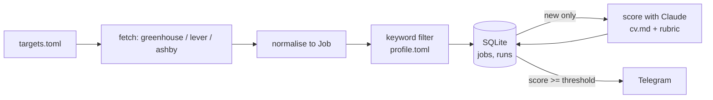

# Design

## Purpose

Find relevant job openings from company job boards without checking them by hand, and send only the ones worth reading to Telegram.

## Data flow

## Job shape (shared by all sources)

| field | type | note |
|---|---|---|
| id | str | `source:company:job_id`, primary key |
| source | str | greenhouse, lever, ashby |
| company | str | from targets.toml |
| title | str | |
| location | str | as given by the board |
| url | str | public posting URL |
| description | str | plain text, HTML stripped |
| first_seen | str | ISO timestamp, set on insert |
| score | int or null | null until scored |

## Decisions

One line each: date, decision, reason.

- 2026-09-28: No frameworks; plain `requests` + stdlib, so every part of the system is visible and explainable.
- 2026-09-28: SQLite over files; gives deduplication by primary key and a `runs` history for free.
- 2026-09-28: Filter by keywords before calling the LLM, so cost scales with relevant jobs, not all jobs.
- 2026-09-29: `targets.toml` and `profile.toml` are gitignored with committed `.example.toml` copies; the job search stays private once the repo is public.
- 2026-09-29: Env vars are loaded by the shell (`set -a; source .env; set +a`), not parsed in code; the same path works under cron, launchd and GitHub Actions.
- 2026-09-30: Greenhouse's `content` field is HTML-entity-escaped on top of the HTML itself (e.g. `&lt;div&gt;`); `sources/greenhouse.py` unescapes once, then strips tags with stdlib `HTMLParser`, no HTML library dependency needed.
- 2026-09-30: `--dry-run` skips `core.store` and `core.notify` entirely rather than storing-but-not-notifying; a dry run has zero side effects, so it can be re-run any number of times without ever affecting what the next real run considers "new".
- 2026-09-30: `jobs/radar.py` catches a per-company fetch failure, logs it, and continues rather than letting one bad board stop the whole run; the error text is written to `runs.errors`. Lever/Ashby resilience and richer failure tests land in Iteration 3 — for now this is the minimum needed so one company can't take down the run.
- 2026-09-30: `sources/lever.py` uses Lever's `descriptionPlain` field directly instead of stripping HTML like Greenhouse — Lever already provides a plain-text variant, so no parsing needed. Its description is shorter than Greenhouse's (missing the bullet-list sections), acceptable for now since scoring quality isn't evaluated until Iteration 5; revisit if evals show it hurts match quality.
- 2026-09-30: `jobs/radar.py` now dispatches fetchers via a `FETCHERS = {"greenhouse": ..., "lever": ...}` dict instead of an if/elif chain — this is the second real source, which is the point "no abstraction until two real uses" says to introduce one.

## Known limitations

- Only companies using Greenhouse, Lever or Ashby are covered.
