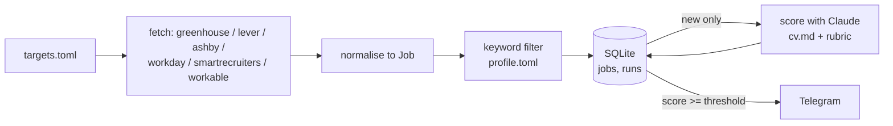

# Design

## Purpose

Find relevant job openings from company job boards without checking them by hand, and send only the ones worth reading to Telegram.

## Data flow

How a job gets its score, step by step (prompt, reply checks, dealbreaker quotes and cap, retries, cost, when it's sent): [`scoring.md`](scoring.md).

## Job shape (shared by all sources)

| field | type | note |
|---|---|---|
| id | str | `source:company:job_id`, primary key |
| source | str | greenhouse, lever, ashby, workday, smartrecruiters, workable |
| company | str | from targets.toml |
| title | str | |
| location | str | as given by the board |
| url | str | public posting URL |
| description | str | plain text, HTML stripped |
| first_seen | str | ISO timestamp, set on insert |
| score | int or null | null until scored |

## Known limitations

- Only companies using Greenhouse, Lever, Ashby, Workday, SmartRecruiters or Workable are covered.
- Workday has no documented public API; the adapter uses the JSON endpoints Workday's own careers pages call, which can change without notice.
- Workday and SmartRecruiters list postings without descriptions; details are fetched (one request per posting) only for titles that pass the title filter.
